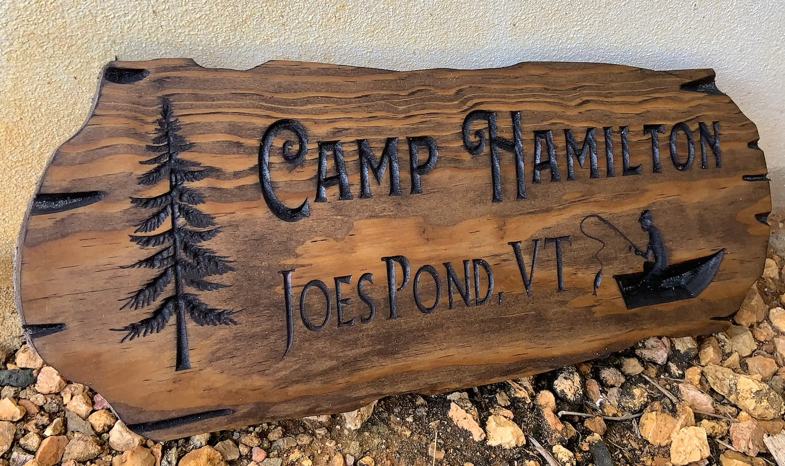
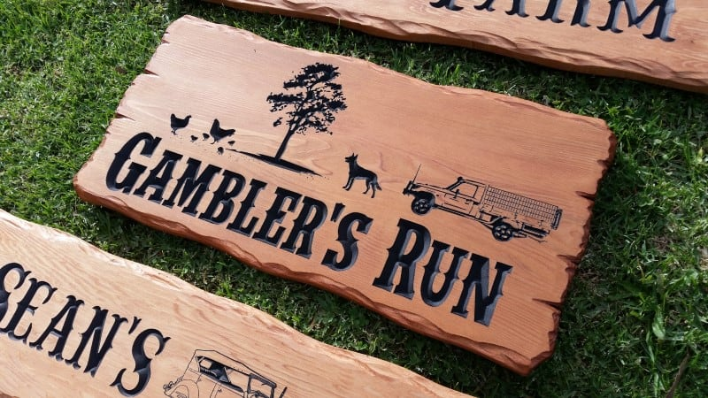
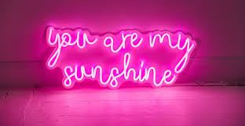
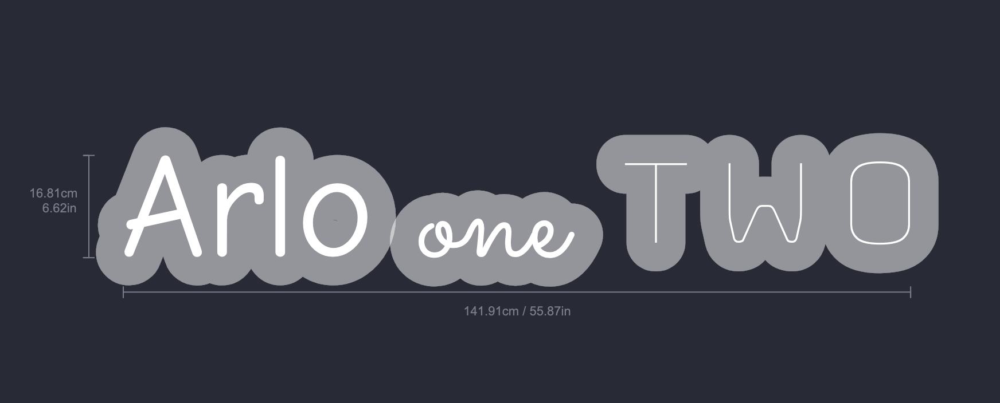

# Canvas Effects

All the required setup code is in the `app.tsx` file.

## Task 1

Create a text effect that looks like a carved wood sign:

Notice how the text is engraved into the wood and has light reflection and depth.

## Task 2

Create a text outline effect that follows the shape of the text:

One possible solution is to by stroking the text, but you will need to find a way to seamlessly connect the edges of the words together.

This must support words on multiple lines.

